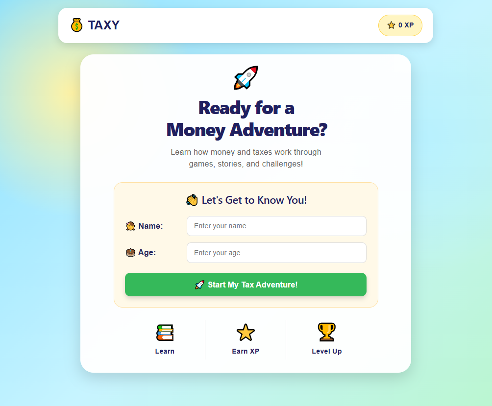

# 💰 Taxy — Taxes Made Fun for Kids

Taxy is a kid-friendly educational application designed to teach children about money and taxes through simple stories, interactive missions, and an XP-based learning experience.

## 🖥️ Application Preview



This repository contains the **React frontend** for Taxy.

## AskTaxy

AskTaxy provides an interactive experience for kids to learn basic tax concepts.

### AskTaxy Home


### AskTaxy Chat


## 🚀 Features

- Create a kid profile with name and age
- Display the kid's current level and XP
- Load age-appropriate tax lessons
- Interactive mission-based learning experience
- XP rewards for completing lessons
- Responsive and kid-friendly user interface
- Integration with a Spring Boot REST API

## 🧒 How It Works

A child starts by creating a profile.

The React application sends the profile information to the Spring Boot backend.

After the profile is created, the child can start learning.

Taxy uses the child's age to request appropriate lessons from the backend.

Example:

```text
Kid Profile
     ↓
React Frontend
     ↓
Spring Boot REST API
     ↓
PostgreSQL
     ↓
Age-Appropriate Lessons
     ↓
Interactive Missions
     ↓
Earn XP ⭐